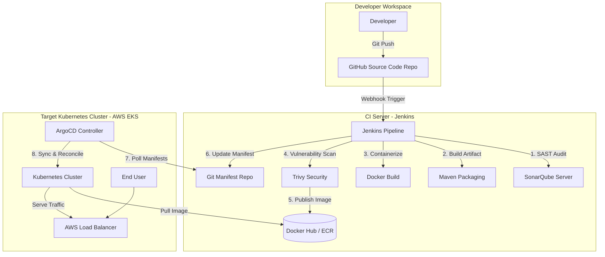
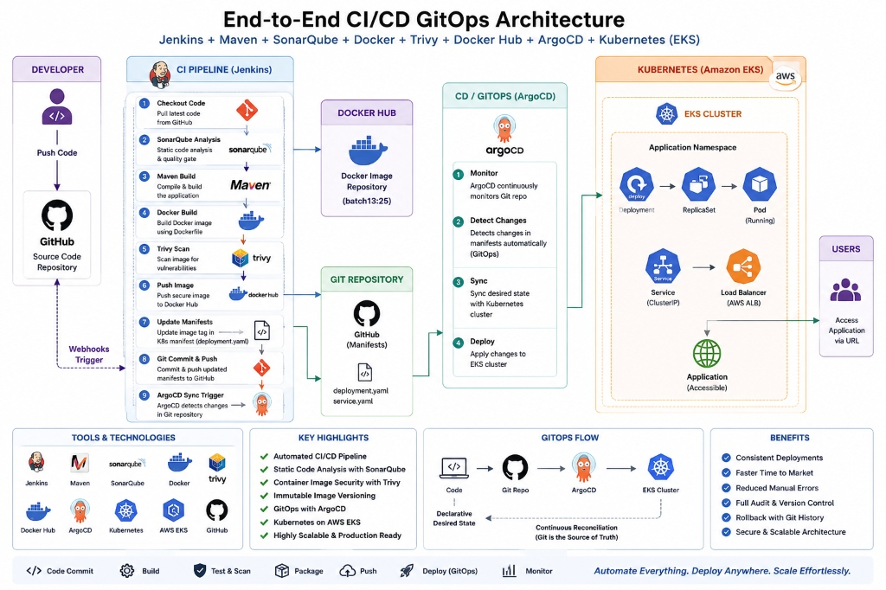
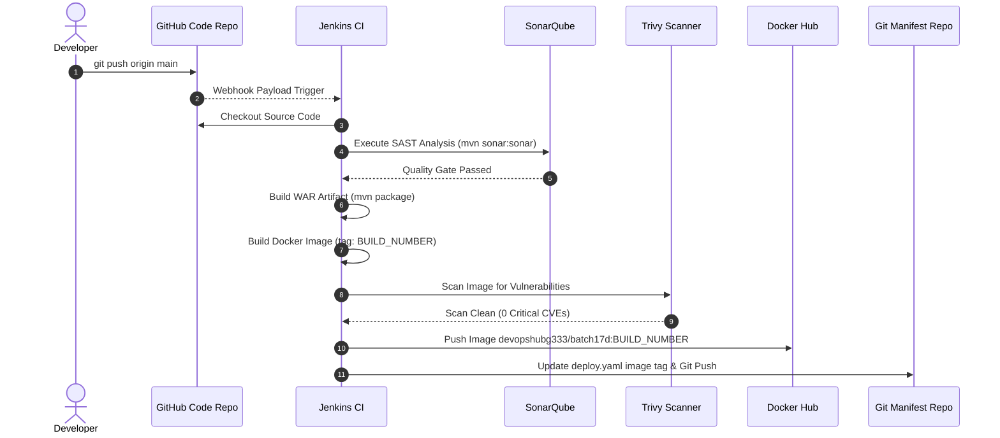
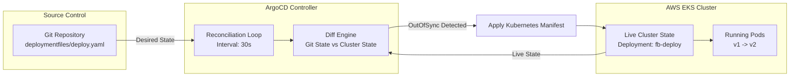
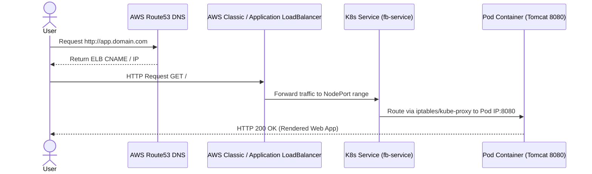
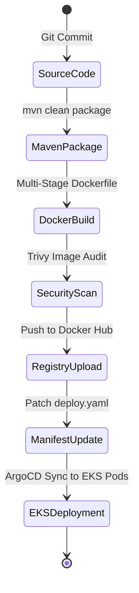

<div align="center">

# 🚀 Enterprise End-to-End GitOps CI/CD Pipeline on AWS EKS

### Continuous Integration, Automated Security Quality Gates, Declarative GitOps CD with ArgoCD, & Production-Grade Kubernetes Orchestration

[](https://aws.amazon.com/eks/)
[](https://kubernetes.io/)
[](https://argoproj.github.io/cd/)
[](https://www.jenkins.io/)
[](https://www.docker.com/)
[](https://www.sonarqube.org/)
[](https://aquasecurity.github.io/trivy/)
[](https://maven.apache.org/)
[](https://www.terraform.io/)
[](https://github.com/features/actions)

---

</div>

## 📌 Project Highlights

* **Automated End-to-End CI/CD**: Zero-touch delivery pipeline trigger on git commit, progressing through security gates to automated deployment.
* **Declarative GitOps Architecture**: ArgoCD continuously reconciles cluster state against Git as the Single Source of Truth, preventing configuration drift.
* **Shift-Left Container & Code Security**: Automated static application security testing (SAST) via SonarQube and container vulnerability scanning via Trivy.
* **Immutable Versioning Strategy**: Dynamic image tagging using strict `${BUILD_NUMBER}` semantics to eliminate non-deterministic deployments.
* **Cloud-Native AWS EKS Orchestration**: Multi-replica Kubernetes workload deployment behind AWS Elastic Load Balancer (ELB) with automated self-healing.
* **Infrastructure & Automation Ready**: Modular architecture designed for seamless migration to Terraform IaC and GitHub Actions CI runner backends.

---

## 📖 Project Overview

This repository implements a production-grade **GitOps Continuous Integration and Continuous Delivery (CI/CD)** pipeline for Java/Jakarta EE web applications deployed onto **Amazon Elastic Kubernetes Service (AWS EKS)**.

The delivery architecture separates CI automation (handled by **Jenkins**) from cluster deployment state management (handled by **ArgoCD**). By introducing Git as the single source of truth for application manifests, the system guarantees auditability, zero-drift security, and deterministic rollbacks.

```
       +-------------------+       +--------------------+       +-------------------+
       |   Developer Commit| ----> |  Jenkins CI Engine | ----> |  Artifact Registry|
       +-------------------+       +--------------------+       +-------------------+
                                             |                                 |
                                             v                                 v
       +-------------------+       +--------------------+       +-------------------+
       |  Production State | <---- |   ArgoCD Engine    | <---- |   Git Manifests   |
       |    (AWS EKS)      |       |  (Pull Sync Loop)  |       |   (State Repo)    |
       +-------------------+       +--------------------+       +-------------------+
```

---

## 🎯 Business Problem

In traditional software delivery models, deployment pipelines frequently suffer from critical operational friction:

1. **Configuration Drift**: Direct `kubectl apply` commands executed from CI servers or operator workstations lead to discrepancy between source control manifests and running cluster state.
2. **Cluster Access Vulnerabilities**: Exposing Kubernetes API server credentials to external CI tools creates a high-severity security surface area.
3. **Unvalidated Image Deployments**: Deploying container images without automated vulnerability scanning introduces supply chain attacks and CVE compliance failures into production.
4. **Downtime During Releases**: Manual rollouts and lack of continuous health checks increase MTTR (Mean Time to Recover) during bad releases.

---

## 💡 Solution Architecture

To eliminate these vulnerabilities, this project establishes a **Pull-Based GitOps Delivery Model**:

* **Decoupled CI & CD**: Jenkins builds, tests, scans, and pushes immutable container images to the registry, then updates the manifest repository. Jenkins **never** communicates directly with the Kubernetes API.
* **Declarative Synchronization**: ArgoCD runs inside the Kubernetes cluster, polling the Git manifest repository. When changes are detected, ArgoCD pulls and reconciles cluster resources state dynamically.
* **Automated Security Quality Gates**: Builds are aborted instantly if code quality metrics (SonarQube) or image vulnerability severity thresholds (Trivy) fail to pass verification gates.

---

## 🛠️ Technology Stack & Selection Rationale

| Category | Tool | Version | Selection Rationale (WHY Selected) |
| :--- | :--- | :--- | :--- |
| **Cloud Provider** | **AWS** | Cloud | Provides enterprise SLA, native IAM integration, and managed Kubernetes control planes. |
| **Container Orchestration** | **Amazon EKS** | `v1.28+` | Eliminates master node maintenance overhead while supporting enterprise VPC networking and CNI. |
| **GitOps Controller** | **ArgoCD** | `v2.9+` | Runs natively inside K8s; continuously monitors Git state and eliminates outbound credential exposure. |
| **CI Automation** | **Jenkins** | `v2.414+` | Industry standard for scriptable, multi-stage pipelines with rich plugin ecosystem and tool isolation. |
| **Static Code Analysis** | **SonarQube** | `v10.x` | Detects code smells, security hotspots, and bugs before artifact compilation. |
| **Container Security** | **Trivy** | `v0.45+` | High-speed OS/package vulnerability scanner; blocks compromised container base layers. |
| **Build System** | **Apache Maven** | `v3.9.x` | Standardized dependency management and build lifecycle execution for Java artifacts. |
| **Container Engine** | **Docker** | `v24.x` | Multi-stage build support producing minimal target runtime footprint (Tomcat base). |
| **Registry** | **Docker Hub / ECR** | Cloud | Centralized repository for immutable image tag resolution and distribution. |

---

## 🏗️ Architecture Decisions

> [!NOTE]
> The architectural selection of components in this pipeline adheres to modern enterprise DevOps principles.

### 1. Why Jenkins over pure GitHub Actions for CI?
While GitHub Actions is highly integrated, Jenkins provides full control over self-hosted build nodes, custom agent isolation, enterprise credential store integration, and scriptable Groovy pipeline flexibility necessary for complex hybrid-cloud enterprise environments.

### 2. Why ArgoCD (Pull Model) over Jenkins Push (`kubectl apply`)?
Traditional CI push deployments require giving Jenkins admin privileges to the EKS API server. ArgoCD operates **inside** the cluster network using ServiceAccounts, pull-syncing state changes. This implements strict least-privilege security and guarantees zero config drift.

### 3. Why AWS EKS over Self-Managed Kubernetes (kops/kubeadm)?
Self-managed control planes require manual ETCD backup management, control plane patching, and high availability engineering. EKS provides a managed 99.95% SLA control plane, allowing engineers to focus purely on application workloads.

### 4. Why Trivy over Clair/Anchore for Container Security?
Trivy offers comprehensive vulnerability detection across OS packages (Debian, Alpine, RHEL) and application dependencies with negligible scan latency, making it ideal for inline pipeline security gates.

---

## 🌟 Key Project Features

* **Strict Shift-Left Security Gate**: Quality Gate failure in SonarQube or Trivy instantly fails the build before image distribution.
* **Automated Git State Mutation**: Pipeline automatically patches `deploymentfiles/deploy.yaml` with the exact Git build ID and commits changes back to source control.
* **Zero-Downtime Rolling Updates**: Kubernetes Deployment metadata triggers smooth pod replacement without dropping active TCP connections.
* **Immutable Tag Enforcement**: Replaces dangerous `:latest` image tags with build-bound unique integer identifiers (`:${BUILD_NUMBER}`).
* **Self-Healing Cluster State**: ArgoCD detects out-of-band manual changes in the cluster and automatically reverts them back to the state declared in Git.

---

## 📐 Architecture Diagrams

### High-Level Architecture




---

### AWS Infrastructure Architecture
```mermaid
flowchart TD
    subgraph AWS Cloud Region: us-east-1
        subgraph VPC 10.0.0.0/16
            subgraph Public Subnets
                IGW[Internet Gateway]
                ALB[AWS Load Balancer]
            end

            subgraph Managed EKS Cluster
                subgraph Private Worker Node Group
                    POD1[Pod: fb-app replica-1]
                    POD2[Pod: fb-app replica-2]
                    POD3[Pod: fb-app replica-3]
                end
                
                subgraph Control Plane Managed
                    API[K8s API Server]
                    ETCD[(ETCD Store)]
                end

                subgraph System Namespace
                    ARGO_POD[ArgoCD Application Controller]
                end
            end
        </div>
    end

    ALB -->|Port 80/443| POD1
    ALB --> POD2
    ALB --> POD3
    ARGO_POD -->|Reconcile State| API
```


---

### CI Pipeline Workflow



---

### GitOps Workflow



---

### Additional Visual Workflows

<details>
<summary>🔍 Click to view Request Flow & Image Lifecycle Diagrams</summary>

#### End-to-End Request Flow Architecture


#### Docker Image Lifecycle Management


</details>

---

## 🔒 Security Implementation & Governance

> [!IMPORTANT]
> Security is embedded directly into every phase of the CI/CD execution pipeline (Shift-Left Security).

### 1. Static Application Security Testing (SAST)
* Integrated **SonarQube** analysis detects vulnerabilities, security hotspots, code smells, and hardcoded credentials during the build phase.
* Pipeline halts instantly if the project violates pre-configured Quality Gate standards.

### 2. Container Vulnerability Scanning
* Every built container image undergoes lightweight, high-precision scanning using **Trivy**.
* Image publishing is automatically aborted upon detection of high/critical OS or package vulnerabilities.

### 3. Production Security Hardening Checklist

| Security Control | Implementation Standard | Current / Recommended Architecture |
| :--- | :--- | :--- |
| **IAM Access** | Least Privilege Model | IAM Roles for Service Accounts (IRSA) on AWS EKS |
| **Container Registry** | Private Repository | Migrate from Docker Hub to **AWS ECR** with image scanning on push |
| **K8s RBAC** | Namespace Isolation | Restricted ClusterRoles & ServiceAccounts for ArgoCD & Applications |
| **Secret Management** | Encrypted In-Flight & At-Rest | Integration with **AWS Secrets Manager** via External Secrets Operator |
| **Network Security** | Microsegmentation | Kubernetes **NetworkPolicies** restricting pod-to-pod ingress/egress |

---

## 📁 Repository Structure

```
GitOps-Project/
├── Dockerfile                                 # Multi-stage Docker build file (Maven build -> Tomcat runtime)
├── Jenkinsfile                                # Standard Jenkins CI/CD pipeline definition
├── Jenkinsfile_Argocd_project                 # Main GitOps pipeline definition updating manifest repo
├── Jenkinsfile_argocd__improved_qualitygate   # Hardened pipeline containing explicit SonarQube quality gates
├── Jenkinsfile_docker_session                 # Isolated pipeline module for container testing
├── Jenkinsfile_env_vars                       # Environment variable template configuration
├── README.md                                  # Production documentation
├── pom.xml                                    # Apache Maven project configuration and dependencies
├── deploymentfiles/
│   ├── deploy.yaml                            # Kubernetes Deployment manifest (Declarative app state)
│   └── service.yaml                           # Kubernetes Service manifest (LoadBalancer service spec)
└── src/
    └── main/
        └── webapp/
            ├── index.jsp                      # Application entry point
            └── WEB-INF/
                └── web.xml                    # Servlet deployment descriptor
```

---

## ⚙️ Prerequisites & Environment Setup

Before replicating or executing this pipeline, ensure your build environment contains the following dependencies:

### Local Infrastructure Tools
* **AWS CLI** (`v2.x+`) configured with appropriate IAM permissions.
* **kubectl** (`v1.28+`) matching the target EKS cluster version.
* **Docker Engine** (`v24.0+`) running locally or on build nodes.
* **Helm** (`v3.x+`) for package management.

### Centralized Services Configuration
1. **Jenkins Server**: Running Java 17+, installed Docker, Maven 3.9+, and Trivy CLI.
2. **SonarQube Server**: Accessible via HTTP from the Jenkins build node.
3. **AWS EKS Cluster**: Functional cluster provisioned via `eksctl` or Terraform.
4. **ArgoCD Controller**: Installed in the `argocd` namespace on EKS.

---

## 🚀 Step-by-Step Implementation Guide

### Phase 1: Infrastructure & Kubernetes Setup

1. **Provision EKS Cluster**:
   ```bash
   eksctl create cluster \
     --name gitops-eks-cluster \
     --region us-east-1 \
     --nodegroup-name standard-workers \
     --node-type t3.medium \
     --nodes 3 \
     --nodes-min 2 \
     --nodes-max 4 \
     --managed
   ```

2. **Verify Cluster Connectivity**:
   ```bash
   aws eks update-kubeconfig --name gitops-eks-cluster --region us-east-1
   kubectl get nodes -o wide
   ```

---

### Phase 2: ArgoCD Installation & Configuration

1. **Deploy ArgoCD to EKS**:
   ```bash
   kubectl create namespace argocd
   kubectl apply -n argocd -f https://raw.githubusercontent.com/argoproj/argo-cd/stable/manifests/install.yaml
   ```

2. **Expose ArgoCD Server UI**:
   ```bash
   kubectl patch svc argocd-server -n argocd -p '{"spec": {"type": "LoadBalancer"}}'
   ```

3. **Fetch Initial Admin Password**:
   ```bash
   kubectl -n argocd get secret argocd-initial-admin-secret -o jsonpath="{.data.password}" | base64 -d; echo
   ```

---

### Phase 3: ArgoCD Application Registration (GitOps Engine)

Define the declarative ArgoCD `Application` resource to track manifest changes in Git:

```yaml
apiVersion: argoproj.io/v1alpha1
kind: Application
metadata:
  name: fb-app-gitops
  namespace: argocd
  finalizers:
    - resources-finalizer.argocd.argoproj.io
spec:
  project: default
  source:
    repoURL: 'https://github.com/Saiteja2101/GitOps-Project.git'
    targetRevision: HEAD
    path: deploymentfiles
  destination:
    server: 'https://kubernetes.default.svc'
    namespace: default
  syncPolicy:
    automated:
      prune: true
      selfHeal: true
    syncOptions:
      - CreateNamespace=true
```

Apply the application spec to the cluster:
```bash
kubectl apply -f argocd-app.yaml
```

---

## 🛠️ Jenkins Pipeline Stage-by-Stage Breakdown

The core CI automation process is defined in [`Jenkinsfile_Argocd_project`](file:///Users/saitejareddy/Desktop/GitOps%20Project/Jenkinsfile_Argocd_project). Here is a detailed breakdown of all 10 pipeline execution steps:

```groovy
pipeline {
    agent any
    tools {
        maven 'maven_3.9.16'
    }
    stages {
        // Stages detailed below
    }
}
```

### Stage 1: Source Checkout
Fetches the latest code commit from the main branch of the repository.
```groovy
stage('Checkout') {
    steps {
        echo 'Checking out Git Repository...'
        git branch: 'main', url: 'https://github.com/devopstraininghub/mindcircuit17d.git'
    }
}
```

### Stage 2: SonarQube Static Code Analysis
Triggers SAST inspection to evaluate quality standards, code smells, and vulnerabilities.
```groovy
stage('SonarQube Scan') {
    steps {
        sh '''
            mvn sonar:sonar \
            -Dsonar.host.url=http://<SONAR_IP>:9000 \
            -Dsonar.token=${SONAR_TOKEN}
        '''
    }
}
```

### Stage 3: Maven Build & Packaging
Compiles Java source code, runs unit tests, and packages the web application into a `.war` file.
```groovy
stage('Build Artifact') {
    steps {
        sh 'mvn clean package'
    }
}
```

### Stage 4: Docker Multi-Stage Image Build
Executes the containerization process defined in [`Dockerfile`](file:///Users/saitejareddy/Desktop/GitOps%20Project/Dockerfile), tagging the image with the unique `${BUILD_NUMBER}`.
```groovy
stage('Build Docker Image') {
    steps {
        sh 'docker build -t devopshubg333/batch17d:${BUILD_NUMBER} -f Dockerfile .'
    }
}
```

### Stage 5: Container Security Vulnerability Scanning (Trivy)
Scans the base OS image layers and application packages for vulnerabilities.
```groovy
stage('Scan Docker Image using Trivy') {
    steps {
        sh 'trivy image devopshubg333/batch17d:${BUILD_NUMBER}'
    }
}
```

### Stage 6: Push Container Image to Registry
Authenticates against Docker Hub using encrypted Jenkins credentials and pushes the immutable image artifact.
```groovy
stage('Push to Docker Hub') {
    steps {
        script {
            withCredentials([string(credentialsId: 'dockerhub', variable: 'dockerhub')]) {
                sh 'docker login -u devopshubg333 -p ${dockerhub}'
                sh 'docker push devopshubg333/batch17d:${BUILD_NUMBER}'
            }
        }
    }
}
```

### Stage 7 & 8: Manifest Mutation & Git Automated Commit
Updates the image tag in [`deploymentfiles/deploy.yaml`](file:///Users/saitejareddy/Desktop/GitOps%20Project/deploymentfiles/deploy.yaml) using `sed` and commits the manifest change back to GitHub.
```groovy
stage('Update Deployment File') {
    steps {
        withCredentials([string(credentialsId: 'githubtoken', variable: 'githubtoken')]) {
            sh '''
                git config user.email "ci-bot@company.com"
                git config user.name "Jenkins CI Bot"
                sed -i "s/batch17d:.*/batch17d:${BUILD_NUMBER}/g" deploymentfiles/deploy.yaml
                git add deploymentfiles/deploy.yaml
                git commit -m "chore(ci): update deployment image to version ${BUILD_NUMBER} [skip ci]" || true
                git push https://${githubtoken}@github.com/Saiteja2101/GitOps-Project.git HEAD:main
            '''
        }
    }
}
```

### Stage 9 & 10: ArgoCD Sync & Kubernetes Rollout (Automated GitOps)
ArgoCD detects the updated manifest commit in Git, pulls the declared state, and performs a rolling update across target pods in EKS.

---

## 🏷️ Immutable Tagging Strategy vs `:latest` Anti-Pattern

> [!WARNING]
> Using the `:latest` Docker image tag in production Kubernetes clusters is an explicit anti-pattern.

### Problems with `:latest`:
1. **Non-Deterministic Rollouts**: Kubernetes `imagePullPolicy: IfNotPresent` prevents nodes from pulling updated images if the tag name remains unchanged (`:latest`).
2. **Broken Auditability**: Impossible to trace a running pod back to its exact Git commit hash or build log.
3. **Failed Rollbacks**: Reverting a deployment manifest that points to `:latest` does not trigger container replacement in the pod spec.

### Production Solution:
This project binds the Docker image tag directly to the pipeline run ID using `${BUILD_NUMBER}` (e.g., `devopshubg333/batch17d:34`). This guarantees strict immutability, instant rollback capabilities, and end-to-end traceability.

---

## 📦 Kubernetes Workload & Resource Specifications

The application infrastructure is defined declaratively under [`deploymentfiles/`](file:///Users/saitejareddy/Desktop/GitOps%20Project/deploymentfiles):

### 1. Workload Deployment (`deploy.yaml`)
Manages stateless application pod replicas across the EKS worker nodes.

```yaml
apiVersion: apps/v1
kind: Deployment
metadata:
  name: fb-deploy
  labels:
    app: fb-app
    env: prod
spec:
  replicas: 3
  selector:
    matchLabels:
      app: fb-app
      env: prod
  template:
    metadata:
      labels:
        app: fb-app
        env: prod
        version: v2_vc
    spec:
      containers:
      - name: facebook-container
        image: saitejareddy2108/gitops:34
        ports:
        - containerPort: 8080
```

### 2. Network Service (`service.yaml`)
Provisions an AWS Elastic Load Balancer (ELB) to route external internet traffic to internal pod container ports.

```yaml
apiVersion: v1
kind: Service
metadata:
  name: fb-service
  labels:
    app: fb-app
    env: prod
spec:
  type: LoadBalancer
  selector:
    app: fb-app
    env: prod
  ports:
  - protocol: TCP
    port: 80
    targetPort: 8080
```

---

## 🔍 Validation, Observability & Verification

To verify application deployment status across the pipeline, run the following diagnostic commands:

### 1. Check Deployment & Pod Status:
```bash
kubectl get deployments -n default -l app=fb-app
kubectl get pods -n default -l app=fb-app -o wide
```

### 2. Verify LoadBalancer Ingress Endpoint:
```bash
kubectl get svc fb-service -n default
```
*Access the external URL reported under `EXTERNAL-IP` in your web browser.*

### 3. Inspect ArgoCD Synchronization Status:
```bash
argocd app get fb-app-gitops
```

---

## 🔄 Rollback & Disaster Recovery Strategy

If an unexpected application error occurs in production, GitOps allows instantaneous rolling back without re-running CI build stages.

```
                  +-----------------------------------+
                  |   Identify Production Issue       |
                  +-----------------------------------+
                                    |
                                    v
                  +-----------------------------------+
                  |  Option A: Git Revert Commit      |
                  |  git revert <bad_commit_hash>     |
                  +-----------------------------------+
                                    |
                                    v
                  +-----------------------------------+
                  |  Option B: ArgoCD UI/CLI Rollback |
                  |  argocd app rollback fb-app-gitops|
                  +-----------------------------------+
```

### Executing Rollback via Git (Recommended):
```bash
git log --oneline
git revert <commit-hash-of-bad-deploy>
git push origin main
```
*ArgoCD detects the revert commit and immediately redeploys the previously verified container image.*

---

## 🚀 Scalability & Production Best Practices

To scale this project for enterprise production workloads, implement the following enhancements:

> [!TIP]
> **Enterprise Production Upgrade Roadmap**

1. **Helm Chart Packaging**: Parameterize Kubernetes manifests into reusable Helm charts to support dynamic environment deployments (Dev, Staging, Prod).
2. **Infrastructure as Code (IaC)**: Automate EKS cluster creation, VPC networking, and IAM policy provisioning using **Terraform**.
3. **Observability Stack**: Integrate **Prometheus** for metric collection, **Grafana** for dashboard visualization, and **Loki / ELK Stack** for centralized log aggregation.
4. **Auto-Scaling Infrastructure**: Enable **Karpenter** or **Cluster Autoscaler** alongside Horizontal Pod Autoscalers (HPA) to dynamically adjust node and pod capacity based on CPU/Memory utilization.
5. **Progressive Delivery**: Implement **Argo Rollouts** for Canary and Blue/Green deployment strategies with automated metric-based rollback gates.
6. **Ingress Control**: Deploy **AWS Load Balancer Controller** to manage Application Load Balancers (ALB) with SSL/TLS termination via AWS Certificate Manager (ACM).

---

## 💡 Lessons Learned & Engineering Insights

* **Decoupling CI and CD improves cluster security posture**: Removing cluster credentials from Jenkins significantly reduces the attack surface area.
* **GitOps ensures zero configuration drift**: Automated sync loops eliminate discrepancies between environments, reducing deployment incidents.
* **Automated security gates prevent supply chain vulnerabilities**: Scanning base container images with Trivy isolates compromised dependencies prior to deployment.
* **Immutable build tags guarantee deployment repeatability**: Replacing mutable tags like `:latest` with `${BUILD_NUMBER}` provides complete traceability and instant disaster recovery.

---

<div align="center">

### 👨‍💻 Maintained by **Senior DevOps Engineering Team**

*Questions or contributions? Feel free to open an Issue or Pull Request!*

</div>
